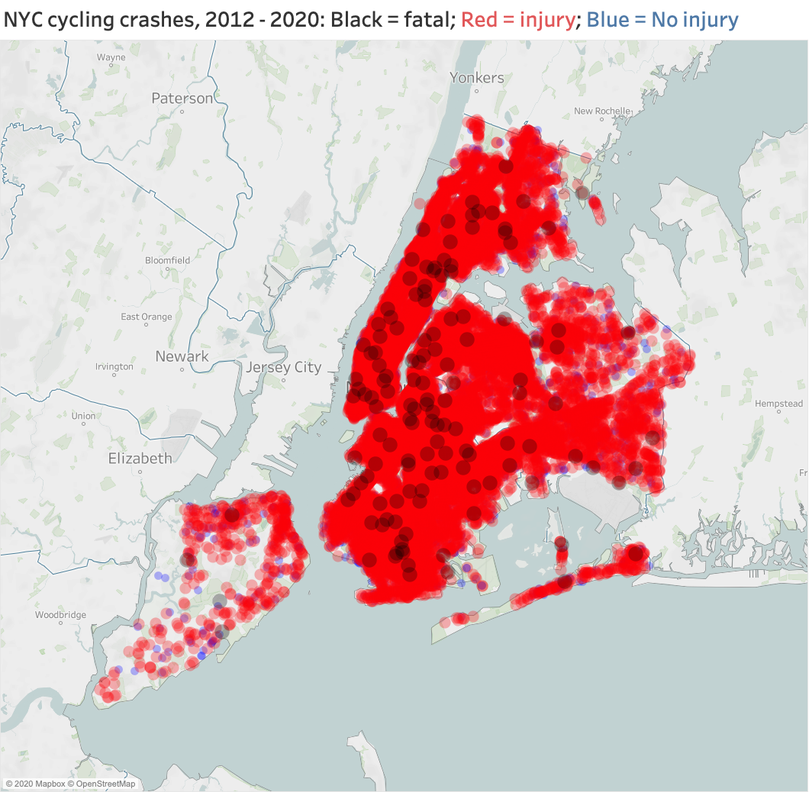
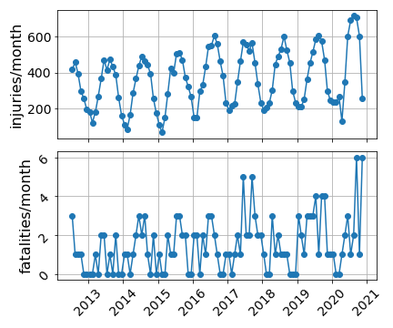
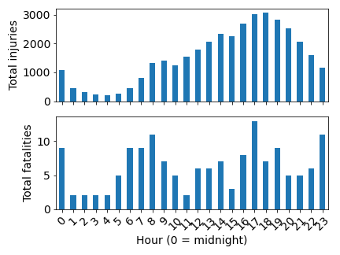

Statement of the problem
========================

A number of studies have shown that, every year, more people are
choosing to commute to work by bicycle in urban areas. The benefits are
obvious: cycling is healthy, inexpensive, and does not create any
pollution.

Safety on the road is a concern for many people. Despite owning a bike,
many do not ride it because they perceive cycling to be dangerous.

Many cities are enhancing bicycle infrastructure. However, from a city
budget standpoint, cost is often cited as a significant barrier to
implementing enhancements, even though it is generally low compared to
the cost of building and maintaining roads for cars.

In light of the cost, is there anything else that can be changed to
increase safety for cyclists? Perhaps there are other aspects of safety
that can be addressed before cities undertake changes to infrastructure.
To answer this, it is necessary to evaluate the relative importance of
factors that result in bike crashes.

The reasoning above is what inspired this study. What are the causes of
crashes resulting in cycling injuries? Can injuries be predicted from
relatively simple information of the circumstances surrounding the
crash, such as when and where, and what vehicles were involved?

Data
====

Case study: New York City
-------------------------

In machine learning and statistical analyses, it is often desirable to
have as much data as possible for model training and statistical
confidence. For that reason alone, New York City was selected because it
is one of the most populous cities in the world.

Source
------

Many New York City municipal departments make data available on-line at
[NYC OpenData](https://opendata.cityofnewyork.us/). The database queried
for this study is the NYPD [Motor Vehicle
Collisions](https://data.cityofnewyork.us/Public-Safety/Motor-Vehicle-Collisions-Crashes/h9gi-nx95)
database.

Data features
-------------

The motor vehicle collision data is comprised of 29 columns. The columns
required for this study are:

1.  Date and time

2.  Location (borough, zip code, GPS coordinates, street names

3.  Number of cyclists injured or killed

4.  Vehicle type

5.  Contributing factor for each vehicle

Most of the crashes in the Motor Vehicles Collisions database do not
involve a cyclist. Therefore, prior to downloading, the database was
filtered for crashes containing either “bike” or “bicycle”. The filtered
data was downloaded as a CSV file.

Cleaning and EDA
----------------

The data set required cleaning to transform it into a useful state for
exploratory data analysis. Listed below are a few important changes.

1.  Find missing zip codes and boroughs by cross-referencing against
    another data source

2.  Fix vehicle names (e.g.: 2-dr sedan → passenger vehicle)

3.  Remove redundant `LOCATION` column

4.  Replace missing coordinates with `nan`

5.  Drop mostly empty `OFF STREET NAME` column

6.  Fix `nan` values in `NUMBER OF PERSONS KILLED` and
    `NUMBER OF PERSONS INJURED`

7.  Change a few variable `dtypes` to integers.

8.  Remove rows with no cyclist involvement.

9.  Sort rows by `DATETIME`

10. Drop duplicate rows

Statistics
==========

Before modelling the crash outcome, it is useful to summarize the crash
outcomes and crash circumstances. The correlations between various
features and targets identified in the statistical summary will inform
the feature engineering and build an intuitive understanding of what
features are expected to be important for predictive purposes.

The breakdown of crash outcomes is shown in
Table <a href="#tab:crash_numbers" data-reference-type="ref" data-reference="tab:crash_numbers">1</a>.

| Crash outcome | Number of events | Percent of total |
|:--------------|:----------------:|:----------------:|
| No injury     |      10,924      |       23%        |
| Injury        |      36,422      |       77%        |
| Fatality      |       150        |       0.3%       |
| Total         |      47,496      |       100%       |

Breakdown of crash outcomes for the time period in this study, July 1,
2012 to November 14, 2020.

One thing to note is that, perhaps counter-intuitively, there are fewer
non-injuries than injuries. The law requires a crash report if there is
an injury or fatality, or if there is property damage in excess of
$1,000 USD. Presumably there are many crashes in NYC for which the
property damage was less than $1,000 USD. If that is true, then crashes
without injury are underrepresented in this dataset.

Location
--------

Location is an important factor that has some impact on the outcome of a
crash. The data contains the location at different levels of
granularity: borough, postal code, zip code, street and cross-street,
and GPS coordinates.

For an overview of how the crashes are distributed throughout NYC, see
the summary map in
Fig. <a href="#fig:outcome_map" data-reference-type="ref" data-reference="fig:outcome_map">1</a>.

<figure>
<figcaption aria-hidden="true">Locations of bike collisions in New York City and surrounding areas. Crashes that did not result in an injury are plotted with small blue dots, however they are not easily visible given the density of events involving injury.</figcaption>
</figure>

Breaking down the crash outcomes by GPS coordinates, street name, and
zip code is not useful at this stage because there are thousands of
unique streets and coordinates, and hundreds of zip codes.

However, the distribution of crashes across the boroughs can be
summarized quickly to illustrate the importance of location. The data
were augmented with population to produce per capita values. The number
of fatalities and injuries is not evenly distributed across the
boroughs. Most injuries and fatalities occur in Brooklyn and Manhattan.
These boroughs also have the highest number of crashes per 100,000
residents. In comparison, Queens, while having a population essentially
the same as Brooklyn, has less than half of the crashes per capita. Both
the lowest absolute and lowest per capita values occur on Staten Island.

Crash vehicles
--------------

Each collision in the motor vehicle collision dataset lists the vehicles
involved in a crash. In almost all cases, a crash involves two vehicles:
one bike and one other vehicle. The crash database contains up to five
vehicles per crash, however such events are exceedingly rare. Some
crashes involve only a bicycle.

In two-party crashes, passenger vehicles are by far the most common
vehicle type, accounting for one-third of deaths and two-thirds of
injuries. Crashes involving taxis, or no other vehicle (i.e., bike
only), are the next most common. Each comprises about 7% of injuries and
3% of deaths.

Some vehicles, such as tractor trailers, dump trucks, buses, and large
commercial vehicles, cause a disproportionately high number of deaths.
When combined, these vehicles were involved in 25% of the fatal crashes,
but very few of the total accidents.

Crash factors
-------------

The motor vehicle crash data set includes a very brief text description
of a crash factor for each vehicle.

The most common factor for deaths, representing 20% of the total, is not
known (labelled `Unspecified` in the data). Other important factors,
each representing 11% or less of the data, are
`bicyclist error/confusion`, `driver inattention`, and
`traffic control disregard`. The factors for crashes resulting in injury
are essentially the same, but one additional important factor is
`failure to yield right of way`.

Date and time
-------------

Every crash included date and time strings. These were combined and
converted into `np.datetime64` objects so that the month, day of week,
and hour could conveniently be extracted.

To illustrate how crash outcomes vary with time, the fatalities and
injuries were aggregated by month and plotted as a time series
(Fig. <a href="#fig:timeseries" data-reference-type="ref" data-reference="fig:timeseries">2</a>).

<figure>
<figcaption aria-hidden="true">Monthly sum of injuries (top panel) and fatalities (bottom panel). Note the sharp drop in injuries in spring 2020 when COVID containment measures went into effect.</figcaption>
</figure>

The monthly total number of crashes resulting in injury increases
steadily over the time series. Superimposed on top of the steady
increase is a strong seasonal cycle. The minimum occurs in mid-winter,
while the maximum occurs in late summer. In contrast, there is very
little indication of a secular trend or seasonal cycle in monthly
fatalities.

The total number of crashes resulting in injury and death were broken
down by hour and summed over the full data record
(Fig. <a href="#fig:hours" data-reference-type="ref" data-reference="fig:hours">3</a>).

<figure>
<figcaption aria-hidden="true">Total number of injuries (top panel) and fatalities (bottom panel) broken down by hour of the day.</figcaption>
</figure>

As one might expect, there are very few crashes late in the night and
very early in the morning. At 5:00 AM, both injuries and fatalities
begin to increase. In the case of injuries, the total number that
occurred each hour rises steadily until 6:00 PM. The number of deaths
does not follow the same trend. Instead, there is roughly a bimodal
distribution with peaks during the morning and evening rush hour.

Modelling
=========

The mixture of numerical data (e.g., time of day) and text data (e.g.,
vehicle type) make this an ideal problem for machine learning
techniques. The statistical summary informed what variables what might
be included as model features. However, those results were found by
simple pairwise comparisons between a single feature and the target.
Fitting a model allows one to assess how well the outcome of a crash can
be predicted by a non-linear combination of all features.

One very important aspect of the modelling is that, in this analysis,
the model target will not include fatalities. While critically
important, fatalities are exceedingly rare in this data, and the
resulting class imbalance makes them very difficult to predict. Some
attempts were made, however the models rarely correctly predicted more
than a few of the 50 or so fatalities in the test data. Therefore, the
model target included crashes that resulted in either no injury, or an
injury. Removing fatalities simplifies the modelling because it is
reduced to a binary classification problem.

Class imbalance
---------------

Even after removing fatalities, the target did not have an equal class
distribution. Instead, the non-injury class constituted 23% of the
total. To balance the classes, the training set was up-sampled by
randomly bootstrapping with replacement.

Feature engineering
-------------------

With some insight from the statistical summary, the following steps were
taken to set up the model features:

1.  Remove `latitude`, `longitude`, `collision_id`

2.  Encode the crash outcome (0 = no injury, 1 = injury)

3.  One-hot-encode borough and zip-code

4.  Generate document-term matrix for vehicles and collision factors

5.  Generate `is_intersection` from `ON STREET NAME` and
    `CROSS STREET NAME`. Remove streets from features.

6.  Generate hour, month, day of week from `DATETIME`

7.  Calculate number of vehicles in accident

8.  Calculate number of factors in accident

Model selection
---------------

After performing a train-test split with 25% of the data reserved for
testing, the training data was up-sampled as described earlier. The
features were scaled for distance-based classifiers.

A range of classifiers in scikit-learn were evaluated “casually” by
using default hyperparameters, and then by exploring hyperparameter
space for the important hyperparameters (e.g., inverse regularization
strength for the logistic regression). Typical accuracy for most models
when evaluated on the test set were in the range of 60% to 70%.

From this experimentation, the random forest classifier consistently
performed best. With default hyperparameters, it achieved an accuracy of
74% on the test set. Based on that, a pipeline and grid search was set
up to evaluate a range of data preprocessing steps and random forest
hyperparameters. The ideal combination of preprocessing and
hyperparameters was the following: no data scaling, principle component
transformation with `n_components=20`, and random forest hyperparameters
of `max_depth=40` and `n_estimators=200`. The accuracy with this model
was 74%.

Evaluation of the optimal model
-------------------------------

The nature of the project goal (safety!), in combination with the class
imbalance warranted a closer look at additional model performance
metrics. Elements of the confusion matrix were analyzed to further
assess the optimized model (Table
<a href="#tab:confusion" data-reference-type="ref" data-reference="tab:confusion">2</a>).
Recall and precision were also considered.

|                 | Predicted non-injury | Predicted injury |
|:----------------|:--------------------:|:----------------:|
| True non-injury |         558          |      2,173       |
| True injury     |         945          |      8,161       |

Confusion matrix for the optimized random classifier model. The accuracy
score on the test set for this model is 74%, the precision was 79%, and
the recall was 90%.

The accuracy score on the test set for this model was 74%, the precision
was 79%, and the recall was 90%. These results might be considered good
but not excellent. However, the recall score was relatively high, and
this particular metric should be regarded as the key metric for this
problem because it is important to correctly identify all injuries.

Feature importance
------------------

Although the logistic regression did not perform as well as other
models, its recall (66%) was good enough to get a feel for how features
ranked. In terms of the vehicle type and collision factors, the
combination most predictive of an injury was a distracted driver in a
passenger vehicle.

Conclusions and future work
===========================

In conclusion, the machine learning model predicted 90% of the injuries
correctly. Important features are time of day, month, vehicle type, and
crash factor.

How might the results be used to improve safety? Many crashes occur at
dusk during rush hour, and so improved street lighting or a campaign to
encourage cyclists to use flashing lights might improve safety. The
results also indicate that distracted driving by those in passenger
vehicles still remains a serious problem. Also, bikes and cars failing
to yield to the right of way and to observe traffic controls are a
problem.

The model performance might be improved by refining the feature
engineering (e.g., encoding the hour of the day), and potentially adding
new features such as weather. A more accurate model (i.e., one having a
better recall), might be found by scoring the grid search models on
recall instead of accuracy.
